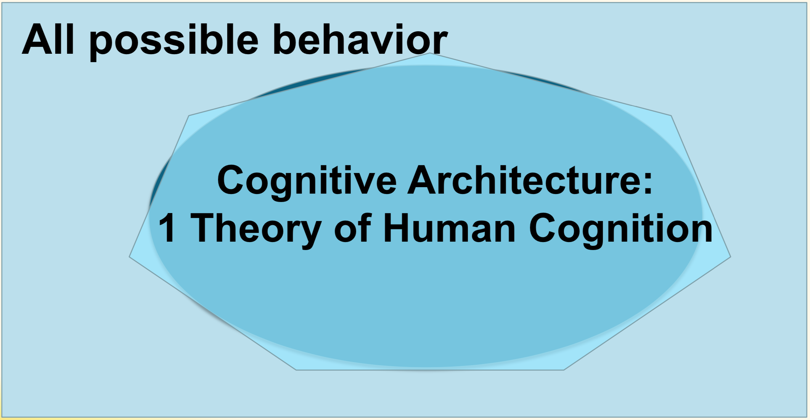
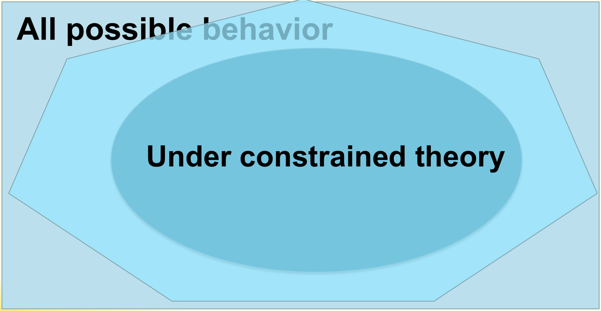
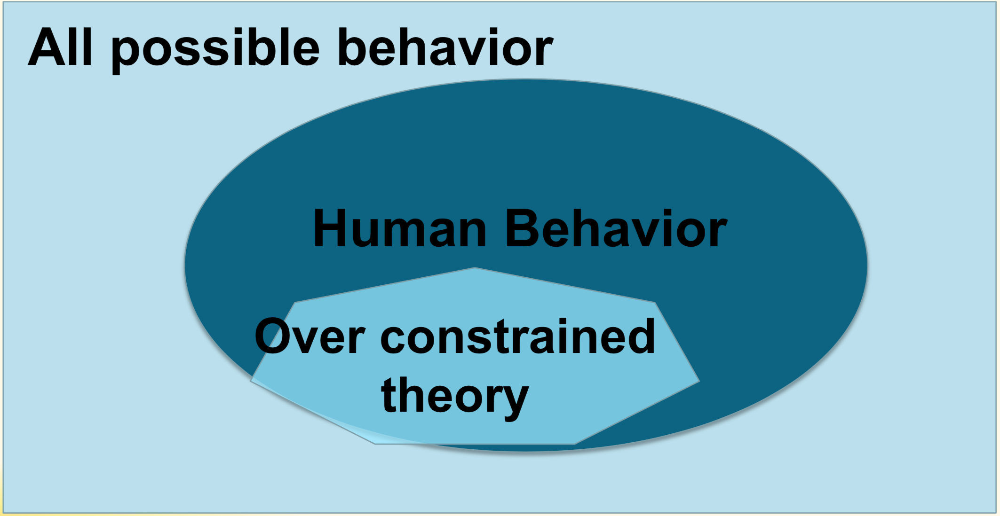
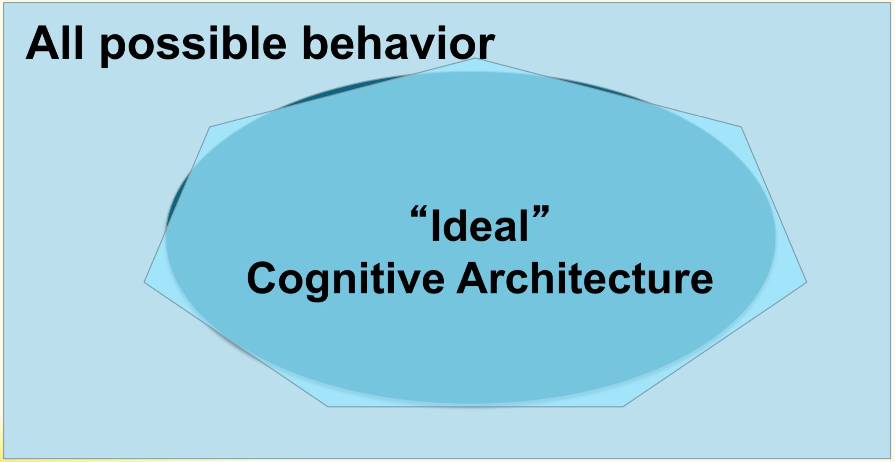
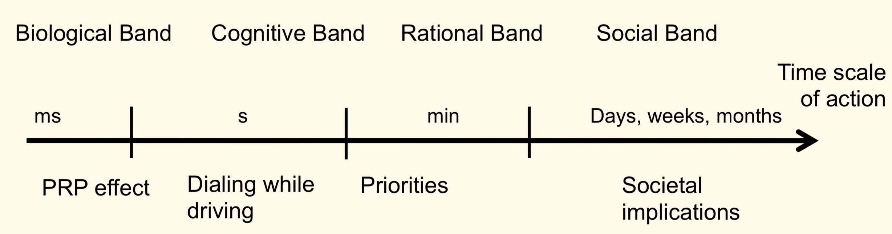
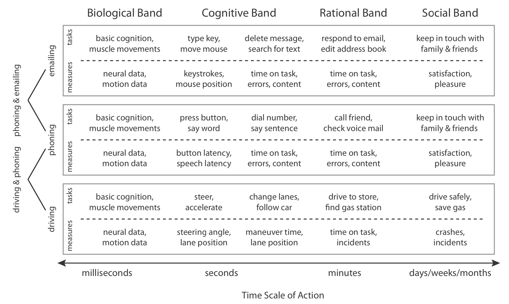

## Cognitive Modeling

Core idea - **Unified Theory of Cognition** (Newell)
* Make psychology more like physics.
* How can the mind occur in the physical universe?

Why use computer models/simulations (in **Science**)?
* **Formal** specification of a theory
* Working code is **detailed**
* Model can make **predictions**
* Understanding by **building**

Why use computer models/simulations (in **Practice/Industry**)?
* Have human-like **experiences**
* Make appropriate and adaptive **decisions** due to understanding of user

Examples:
* Intelligent tutor systems
* Intelligent game opponents
* Usability test:  Distract-R
* Adaptive interface: interruptions
* Software/Interface (Re-)Design

### Cognitive Architecture

Newell’s goal: Develop 1 theory that can describe (almost) all facets of human behavior

“a specification of the **structure** of the **brain** at the level of abstraction that explains how it achieves the **function** of the mind”
* What brain can & can’t do (**function**)
* How brain does that (**structure**)
* What general **parameters** & **equations** govern behavior

### Cognitive Model

* A model of a specific task or process
* Developed within or inspired by the cognitive architecture

Test a model:

Example - Multitasking in ACT-R
* Identify **which functions** are achieved by the brain/cognition **on each time step**
* Specify **each process** using principles of the architecture
	* **Which module** executes this process?
	* **How** this mododule executes this process?

### Cognitive Architecture vs Cognitive Model

Architecture questions:
* What is our general memory capacity?
* How do we forget information over time in general?
* How much visual information can we process per time unit?
*  How do we control our hands in general?

Model questions:
* How do we calculate 101 x 7 – 3 (given architecture)
* How do we control a car (given architecture)
* How do we divide time between driving and making a phone call (given architecture)

### Cognitive Architecture vs Turing Machine

* Turing Machine: Computer simulations can **do more than humans**.
* Cognitive Architecture: Do tasks **in a “human way”**.

	
	

Ideal cognitive architecture:

	

### Advantage of Cognitive Architecture

* Formal specification
	* One framework to describe behavior in multiple settings
* Working code is detailed
* Model reuse & predictions
* Understand by building & active testing

### Disadvantage of Cognitive Architecture

* Requires many **details** (all modules)
* Some assumptions are **hidden**
	* Default parameter settings
* Not always clear which component of model is **critical/essential** for behavior
* Sometimes models are **too specific** or **not specific enough** for the process that you are interested in
* **Falsification** is difficult

### Level of Abstraction

* In what **process** are you interested?
* What are the **steps** that are involved in this process **over time**?

### Reference

* https://www.interaction-design.org/literature
* https://www.rekentuin.nl/
* https://www.youtube.com/watch?v=AplG6KnOr2Q
* https://www.youtube.com/watch?v=FAU2l4ZgDsw
* https://users.aalto.fi/~jokinej10/visual-search/

