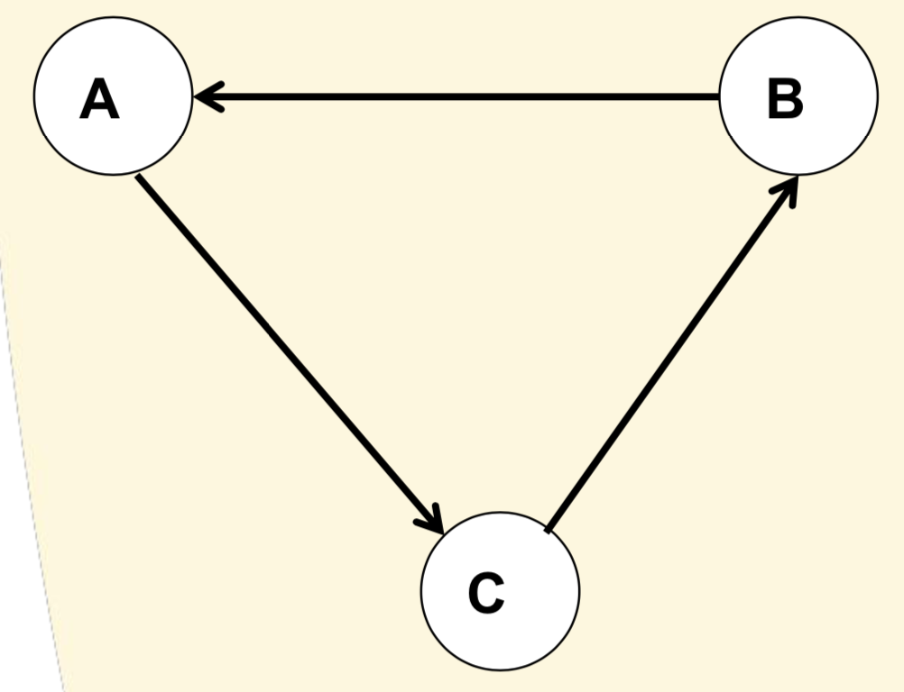

## Computational Argumentation

### Nonmonotonic Logics

**Nonmonotonic logics**: Reasoning in which information at one point is accepted as true, but it can be at a later point rejected. 
* FOL and DL are monotonic logics

**Nonmonotonic reasoning**:
* **Contradictory information**
	* p ∧ ¬p ⊢ ⊥
	* ∀p∀q: p ∧ ¬p ⊢ q

* Why NOT **propositional logic**?
	* Inconsistent:
		* Scheduled → Lecture 
		* Scheduled ∧ Ill → ¬Lecture
	* Scheduled does not imply Lecture:
		* Scheduled ∧ ¬Ill → Lecture
		* Scheduled ∧ Ill → ¬Lecture

### Argumentation

**Argumentation** provides principled techniques for resolving **inconsistency**.

**Arguments** are reasons for conclusions: premises -> inference rules -> conclusions.
* p, p → q -> Modus Ponens -> q
* p ∧ q -> ∧-Elimination -> p

**Syntax of Arguments**
* Arguments are **trees**.
* Nodes are **logical language L**
* Links are inference rules:
	* Rs = **Strict rules**
	* Rd = **Defeasible rules**
	* Rules are based on typical rules or generalizations we use in everyday reasoning
		* Birds can (usually) fly
		* If expert E says P, we can usually believe P
		* If action A causes G and G is good (bad), then we should (not) do A
* Reasoning starts from a **knowledge base K** ⊆ L

**Argumentation System** is a triple AS = (L, R, n)
* L is a **logical language** with negation ¬
* R = Rs ⊔ Rd
* n: Rd → L

**Argumentation Theory** is a pair = (AS, K)
* K ⊆ L 
* K = Kn ⊔ Kp
	* Kn = necessary premises (axioms)
	* Kp = ordinary premises (assumptions)

### Counterarguments

Arguments can **attack** / **defeat** each other:
* **Undercutting**: Attack the inference
* **Undermining**: Attack the premise
* **Rebutting**: Attack the conclusion

### Argumentation Semantics

Argumentation semantics are **dialectical**.
* FOL semantics are **model-based**.

**Argumentation Framework** is a pair = (Args, D)
* Args is a set of **arguments**
* D is the **defeat** relation on Args

a set of arguments A is an **admissible extension** if:
* **conflict-free**: no arguments a and b, such that a attacks b
* **acceptable** with respect to A: for an argument a, there is an argument b that attacks a, and there is an argument c that attacks b

An **admissible extension** is a **preferred extension** if it is a **maximal admissible extension**.

Preferred extensions: {A, C}

Preferred extensions: {A}, {B}

Preferred extensions: ∅

Preferred extensions: {A, D}, {B, C}

Preferred extensions: {C, D, B}, {C, D, E}

