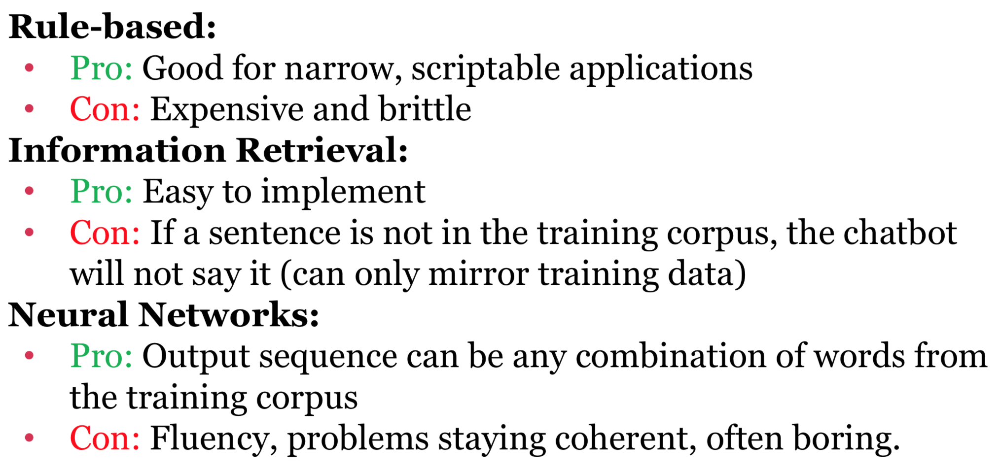

## Conversational Agent

### Chatbot

**Rule-based**:
* Pattern-action rules (ELIZA)
	* ELIZA looks for **keywords**
	* Keywords have a **rank**
	* Keywords have **pattern**/**transform** rules
		* Pattern: sentence of users
		* Transform: response to users
	* ELIZA has **standard answers** and a clever **memory trick**
* A mental model (Parry)

**Corpus-based**:
* Information Retrieval (IR) based
	* Return **the most similar turn**
	* query = "do you like Doctor Who?"
	* turn = “you like Doctor Who?”
	* response = response(argmax similarity(query, turn))
* Neural networks
	* Challenges:
		* Staying **coherent**
		* Short, common sentences have high probabilities (**boring**)

### Goal-based dialogue system

**Tasks** can often be represented as **frames**.

A **frame consists of a set of **slots** to be filled with a **value** of a given **type**.

Each **slot** is associated with a **question** to the user.

**Dialogue initiative**: who has control of conversation?
* **System initiative**: System asks questions & User answers questions
	* Simple to build
	* User always knows what they can say next
	* System always knows what user can say next
		* Known words: Better performance from ASR
		* Known topics: Better performance from NLU
	* OK for VERY simple tasks
	* Too limited
* **System initiative** + **Universals**: Commands you can say anywhere, e.g. "Help", "Start over", "Correct"
* **User initiative**: User asks questions & System answers questions
	* Users know what system can do
	* System is **reactive**
	* System can't: 
		* Ask questions back
		* Engage in **clarification** dialogue
		* Engage in **confirmation** dialogue
* **Mixed initiative**: Simplest type of mixed initiative is to use **frames** to guide dialogue
	* **Domain classification**
	* **Intent determination**
	* **Slot filling**
	* HOW: **Rule based** & **Machine learning**
	* Evaluation: **Slot Error Rate (SER)**

### Grounding

**Principle of closure**: Agents performing an action require evidence, sufficient for current purposes, that they have succeeded in performing it.

**Confirmation**:

### Evaluation

