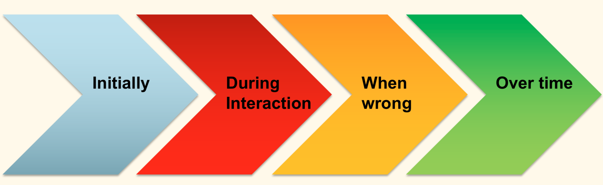
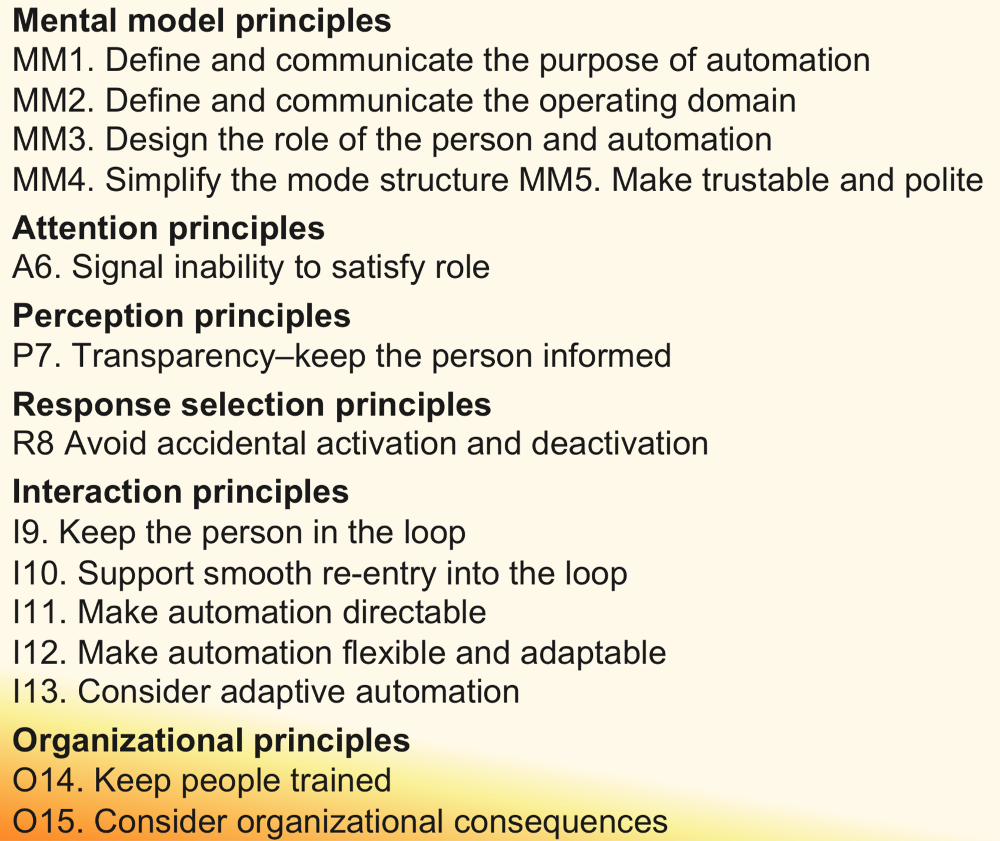

## Design

### Automated System

Why is designing for human-automation (and AI) interaction tricky?
* Dynamic **Humans**
	* Iron of Automation
		* Function (re-)allocation (re-appropriation)
		* Human behaviour changes
	* (Un-)Learning of skill
* Dynamic **Machines**
* Dynamic **Contexts**
* Dynamic **Interaction**

### Guidelines for Design

Microsoft: https://www.microsoft.com/en-us/research/project/guidelines-for-human-ai-interaction/

Lee: Designing for People
