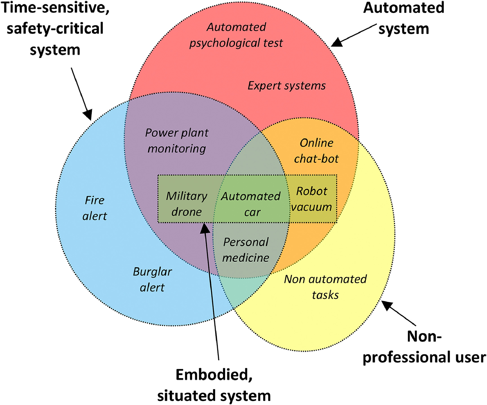

## Design

### Automated System

Why is designing for human-automation (and AI) interaction tricky?
* Dynamic **Humans**
	* Iron of Automation
		* Function (re-)allocation (re-appropriation)
		* Human behaviour changes
	* (Un-)Learning of skill
* Dynamic **Machines**
* Dynamic **Contexts**
* Dynamic **Interaction**

### Guidelines for Design

Microsoft: https://www.microsoft.com/en-us/research/project/guidelines-for-human-ai-interaction/

Lee: Designing for People

### Reference

* https://www.sciencedirect.com/science/article/pii/S1071581919300552#fig0001
* https://www.autofutures.tv/2019/05/22/nissan-unveil-worlds-first-next-gen-driver-assistance-system/
* https://www.youtube.com/watch?v=jLud5XYfY_c
