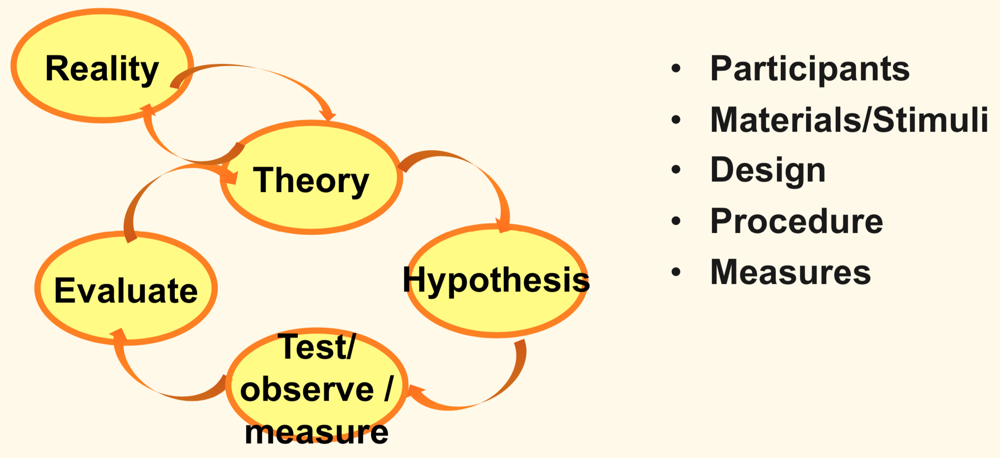
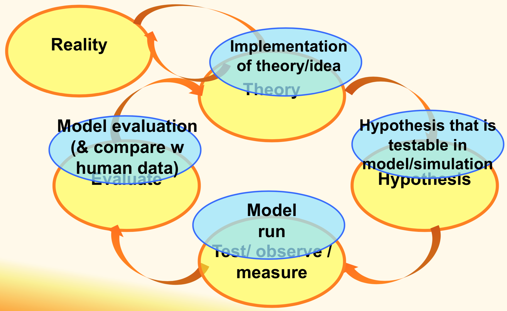
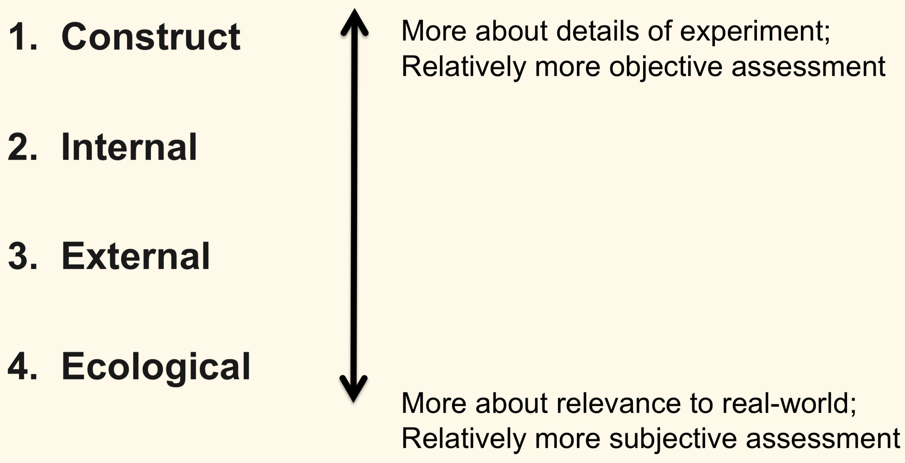
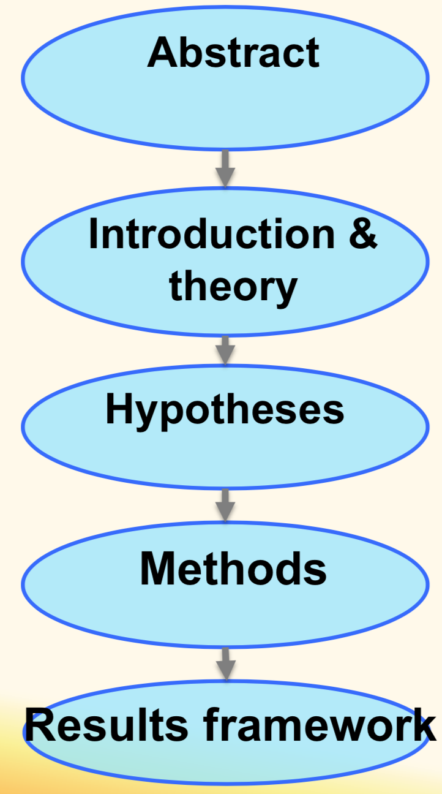

## Experimentation

### Empirical Cycle

### Empirical Report

**Methods** section:
* **Participants**
	* 18 participants
	* Informed consent
* **Materials**/**Stimuli**
* **Design**
	* Within-subjects: driving **condition**
		* Stationary
		* Autonomous
		* Manual
	* Between-subjects: response mode
		* Active **condition**
		* Passive **condition**
	* Condition order: **Counterbalanced**
* **Procedure**
	* Consent signing & explanation
	* Practice driving
	* Practice oddball
	* Apply EEG cap
	* 12 trials of 3 conditions
	* Questionnaire
* **Measures**
	* Reaction time
	* ERP

**Interpretation**:
* Susceptibility to alerts is reduced under **autonomous driving conditions**
* Especially when listening **passively**

**Implication (for Reality)**
* Systems rely on alerts, but people might not notice them

**Limitation**
* Not tested under **distracted conditions**

### Terms

**Manipulation**:
* Controll **Independent variable** / **Factor** / **Condition**
* Test causal effects: **factor** X on **variable** Y

**Independent variable** / **Factor** / **Condition**:
* Manipulated through a **manipulation**
* Have different **Levels**
	* driving condition: stationary, autonomous, manual
* Have a **measurable effect** on **Dependent variable**
* Described in **Design** of **Method** section

**Dependent variable**:
* Measured
* Dependent on **Independent variable**
* Described in **Measures** of **Method** section

**Within-subjects Design**:
* All participants experience **all levels of a factor** typically **in different orders**
* Different groups of participants experience **different levels of a factor** (A/B test)

**Confound**
* Something that you failed to control which **co-varies** with **Independent variable**
* Make it **impossible to draw valid conclusions**

### 4 Types of Validity

### Why is Early Writing important?
* Writing shapes the **scientific process**
* ‘Final Version’ can be rewritten

	

### Where some Big Data Research goes wrong?
* Data is collected **without a reason WHY** 
	* At cost of privacy, storage and time
* Not clear **whether data is best measure**
	* **Construct validity** at risk
* **Statistical techniques** are sometimes incorrectly applied
	* Hypothesis requires an a **priori hypothesis**
	* Hypothesis is presented as if it was there all along
* Net result:
	* Findings are presented as **theory based**, but they should be presented as **exploratory**

### Reference

* https://www.interaction-design.org/literature/book/the-encyclopedia-of-human-computer-interaction-2nd-ed/experimental-methods-in-human-computer-interaction
* https://journals.plos.org/plosone/article?id=10.1371/journal.pone.0201963
* https://dl.acm.org/citation.cfm?doid=2967934.2968079
* http://mi-lab.org/projects/resi/
* https://www.youtube.com/watch?v=HuHuVSDf77I
