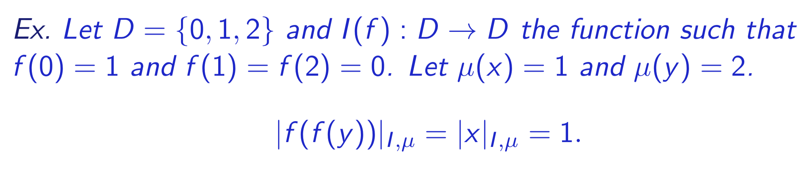
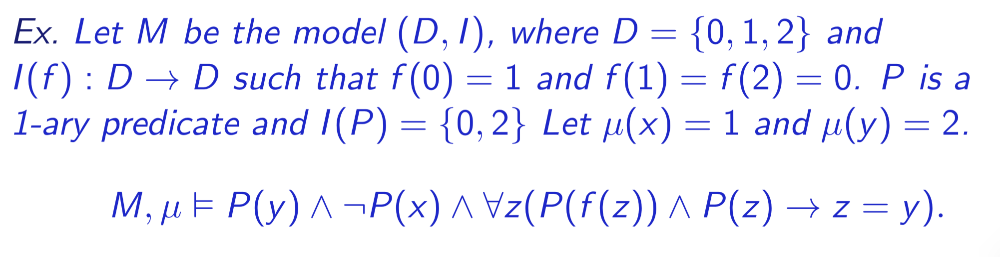
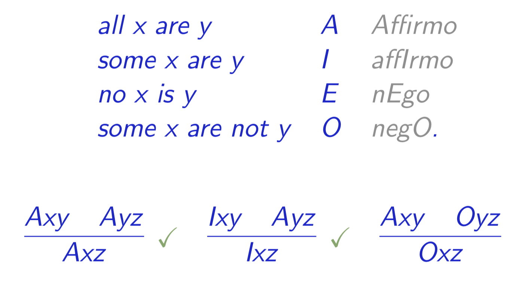

## First Order Logic

a **model** M = (D, I):
* D is **domain**
* I is **interpretation** that interprets the language in D
	* for n-ary predicate P(x1, ..., xn), I(P) is a subset of Dn
	* for n-ary function f(x1, ..., xn), I(f) is a function from Dn to D
* **valuation**/**variable assignment** μ assigns elements of D to the variables
* **denotation** |t| or |t|I, μ of a term t:
	* if t is a variable x, then |x|I, μ = μ(x)
	* if t = f(t1, ..., tn), then |t|I, μ = I(f)(|t1|I, μ, ..., |tn|I, μ)

a formula φ is **valid**/**satisfied** in M under valuation μ: (M, μ |= φ) if:
* φ = P(x1, ..., xn) and (|t1|I, μ, ..., |tn|I, μ) belongs to I(P)
* φ = φ1 ∧ φ2, and (M, μ) |= φ1 and (M, μ) |= 􏳚φ2
* φ = φ1 ∨ φ2, and (M, μ) |= φ1 or (M, μ) |= 􏳚φ2
* φ = ¬ψ, and (M, μ̸) does not entail 􏳚ψ
* φ = ∃x ψ(x), if (M, μ') |= ψ(x) for some valuation μ' that differs from μ at most at x
* φ = ∀x ψ(x), if (M, μ') |= ψ(x) for all valuations μ' that differ from μ at most at x

### Syllogism

	

