## K-nearest Neighbors

### Vector

Represent instances using **feature vectors**, and types of features are as below:
* **Numerical** feature: e.g. number of likes, temperature.
* **Binary** feature: e.g. are A and B friends? Employed?
* **Categorical** feature: e.g. Country, Genre of a text.

Feature vectors are points in **vector space**, and each **dimension** represents a feature.

### Distance

**Distance** = **Similarity**, which can be measured in **vector space**.

**Length/Norm of a vector**

	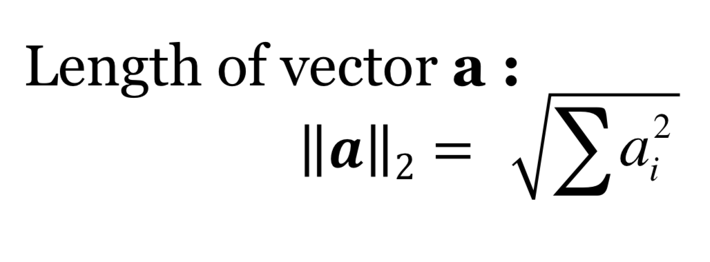
	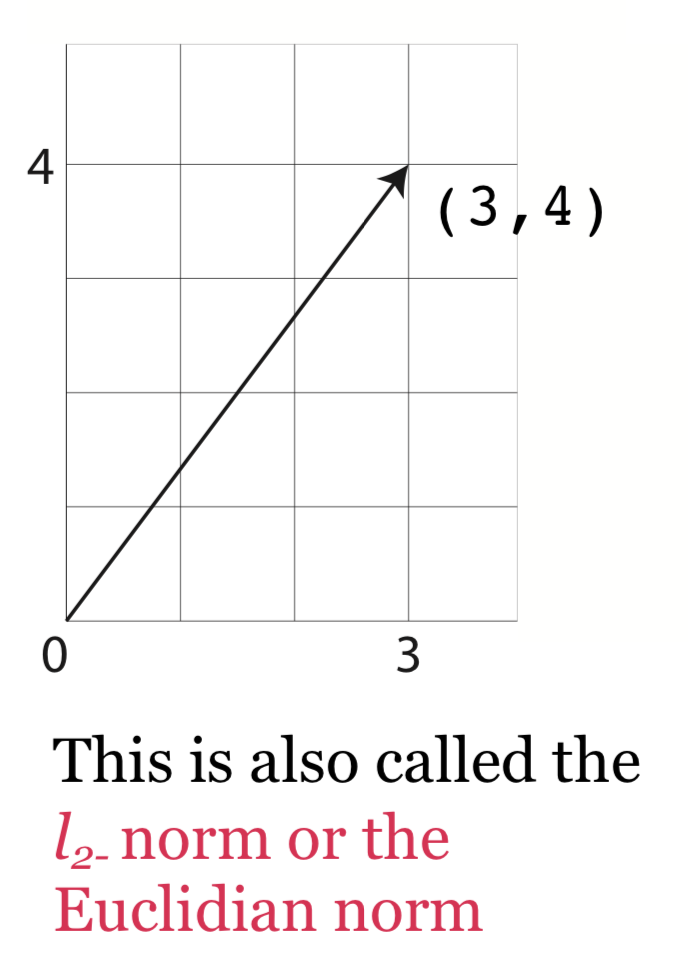

**Euclidian/L2 distance**: Distance between endpoint of vectors.

	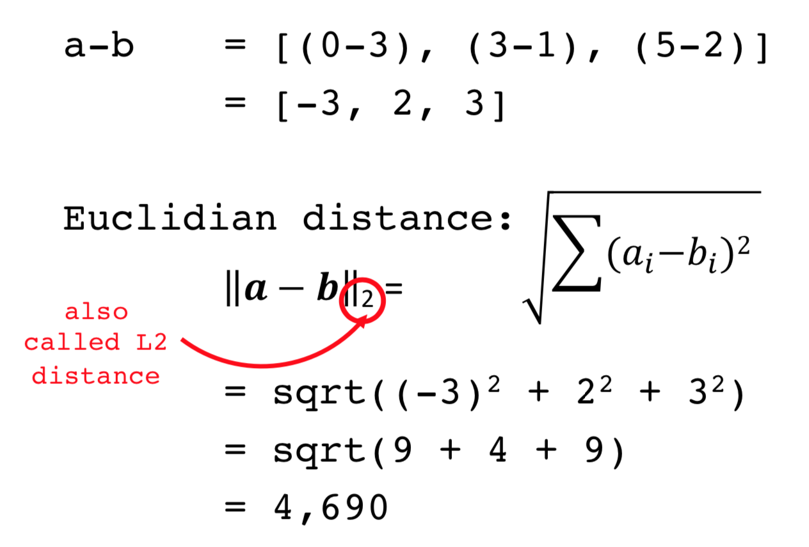

**Manhattan/L1 distance**: Distance between endpoint of vectors.

	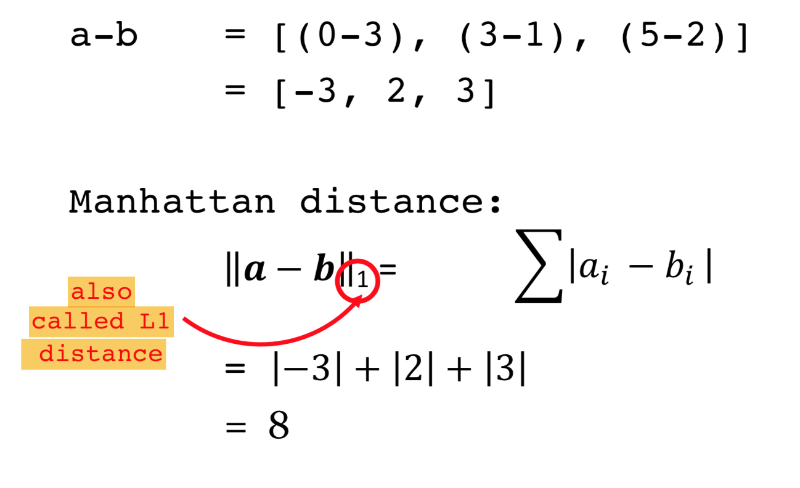

Different distance measure -> Different neighborhoods

	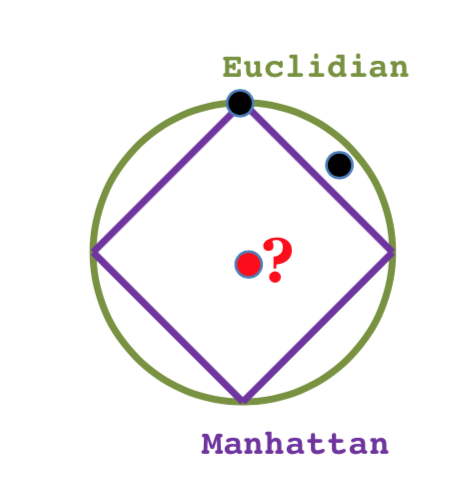
	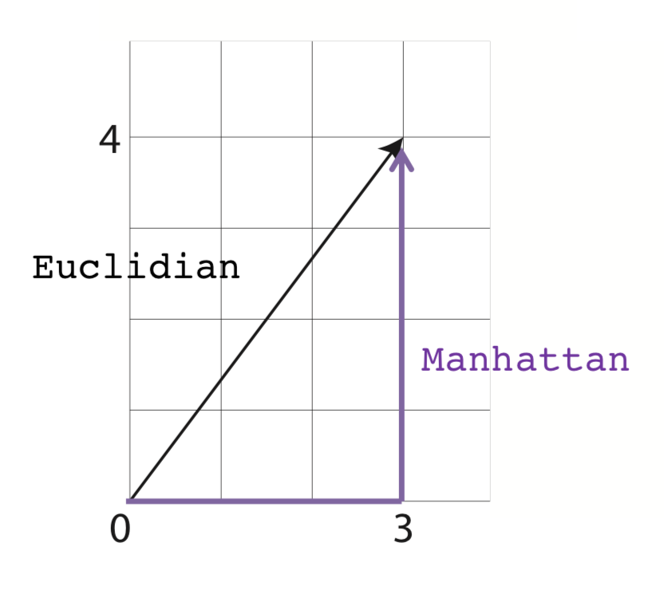

**Minkowski distance**: Generalization of the Euclidian and Manhattan distance.

	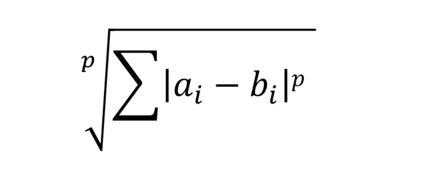

**Jaccard similarity**
* Frequency and order of words are ignored.

	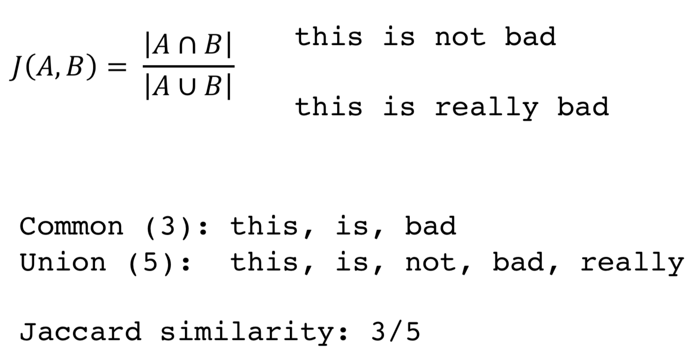

**Dot product**

	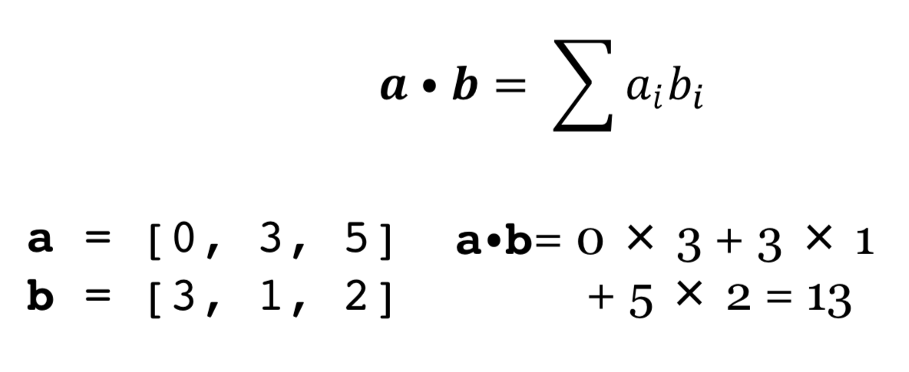

**Normalization of a vector to unit length**

	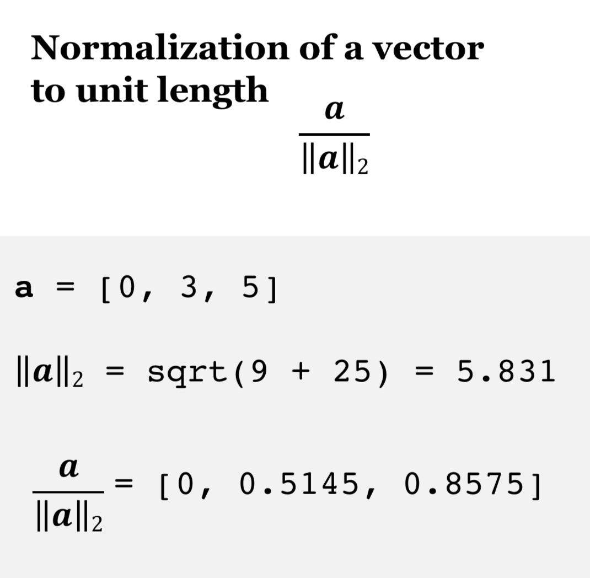

**Cosine similarity**: Normalized dot product.

	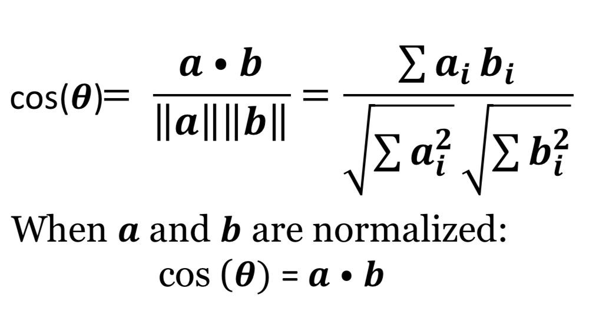
	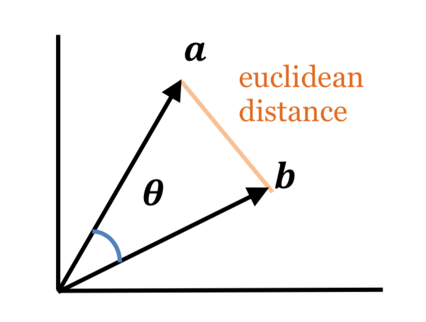

### K-nearest neighbors

This is **memory-based/instance-based learning**.
* Training is fast
* It’s easy to add new training data
* Making predictions is slow
* Need to store the training data

**1-nearest neighbors**

	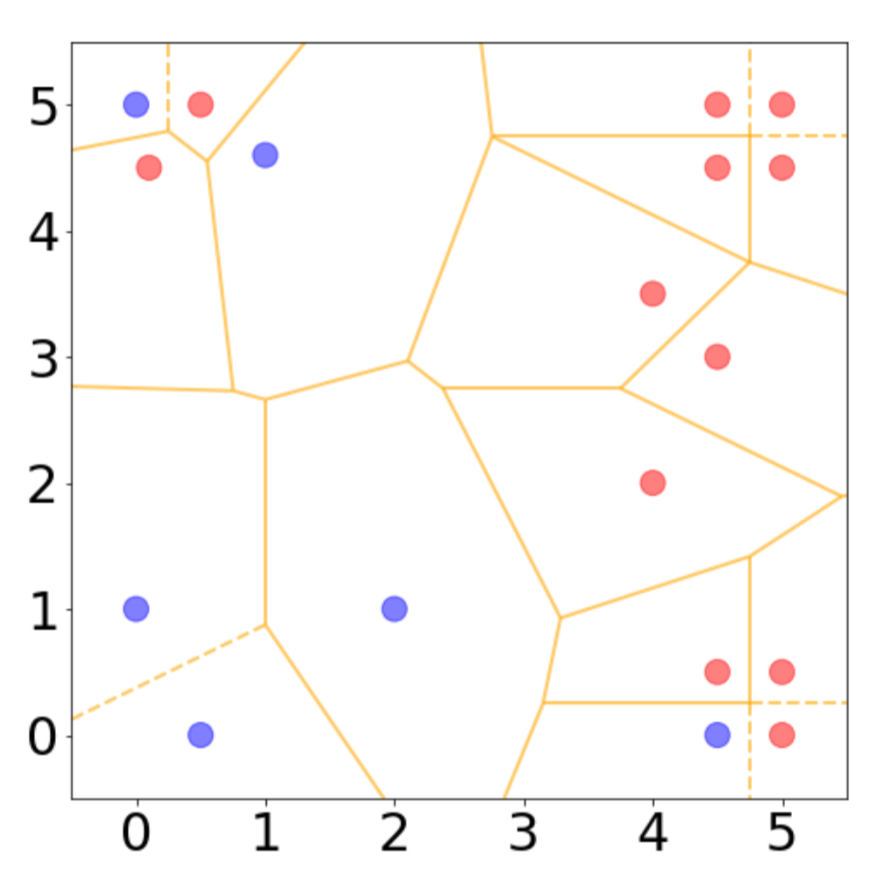
	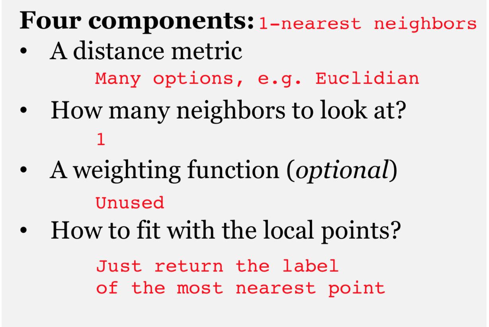

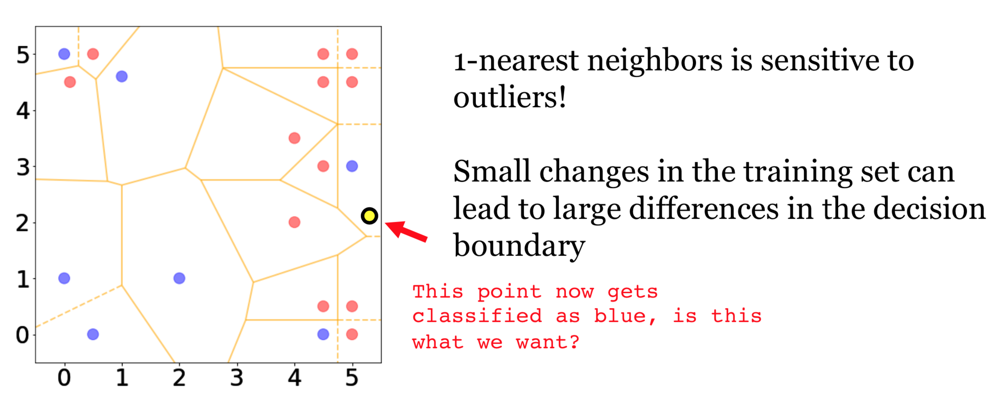

**k-nearest neighbors**

	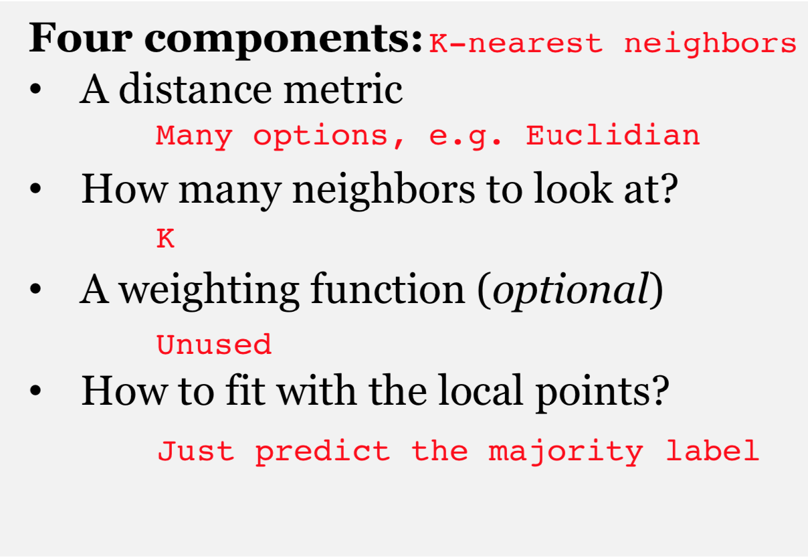

* Classification speed does not depend on **number of classes**
* Classification speed depends on **number of instances**
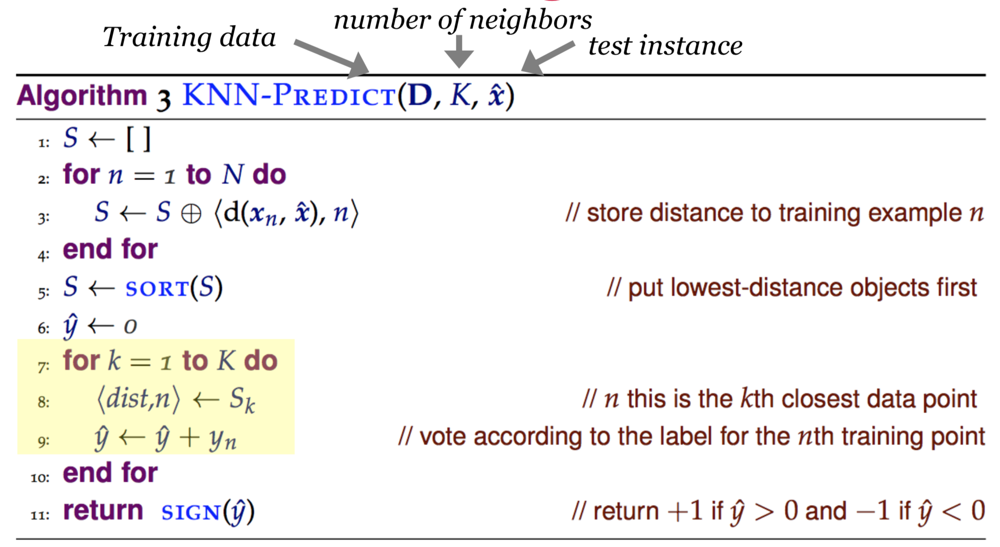

**decision boundary**
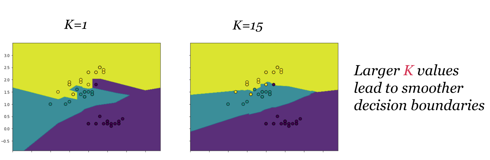

**Decision tree vs K-nearest neighbors**
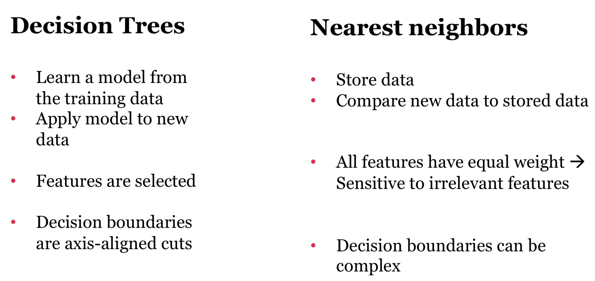

### Reference

* https://spacy.io
* https://web.stanford.edu/~jurafsky/slp3/
* http://www.nltk.org/

