## Regression

### Linear Regression

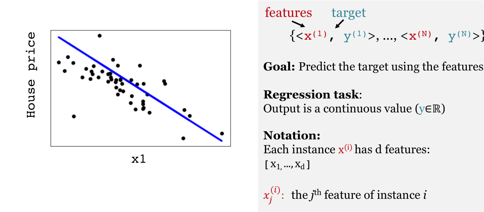

#### This is a **linear model**

	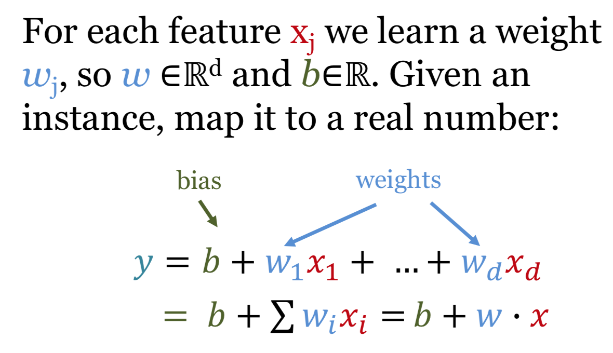
	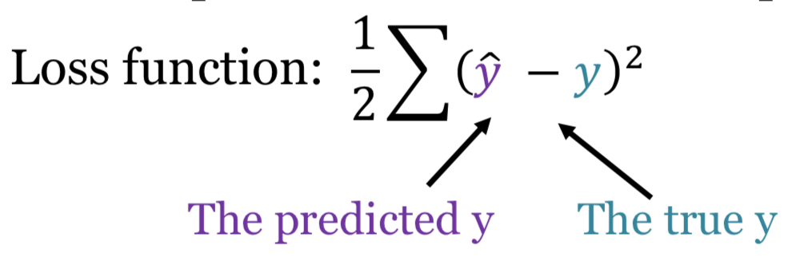

### Logistic Regression

#### Probability can be used for predicting a class.
* predict 1, when P(y=1|x) ≥ 0.5
* when we increase the threshold from 0.5 to 0.8, precision goes up and recall goes down.

	
	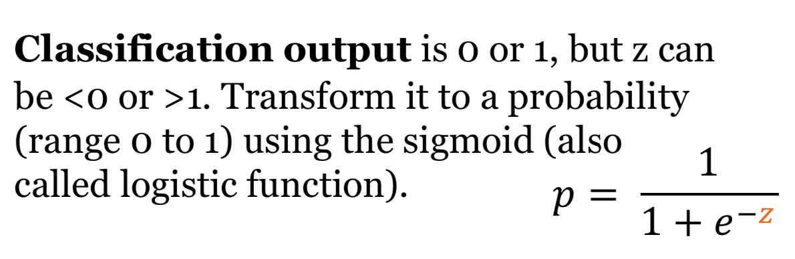

#### Decision boundaries: Logistic regression is a linear classifier!

	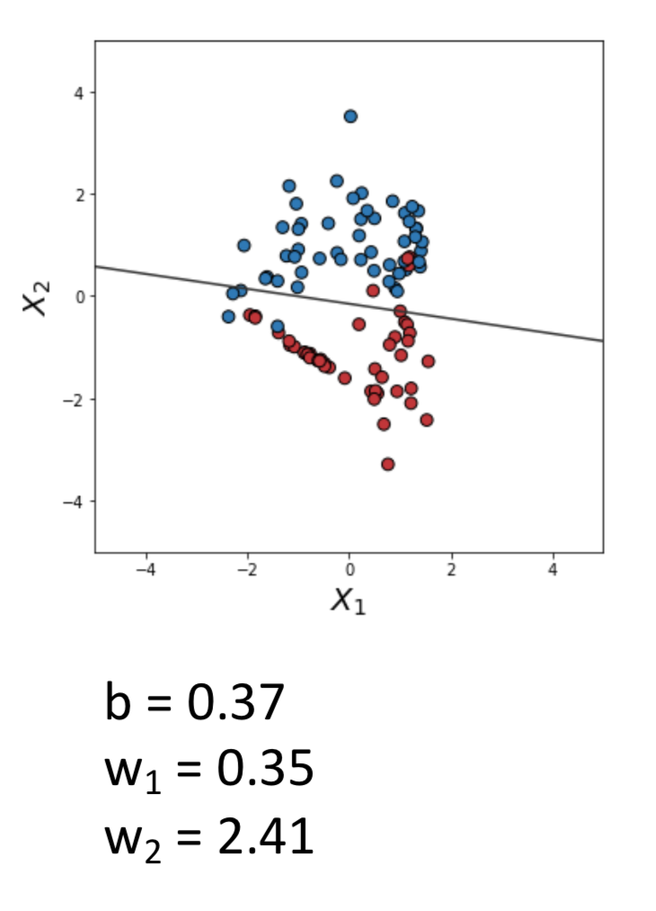

#### Example
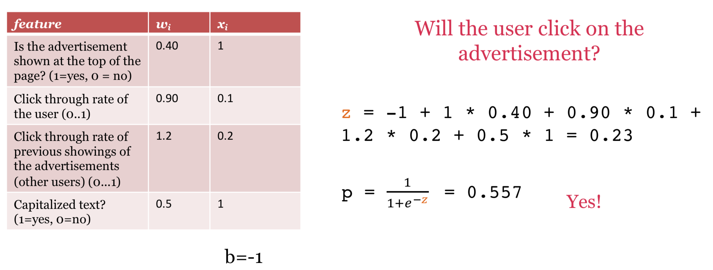

Where does the sigmoid function come from?
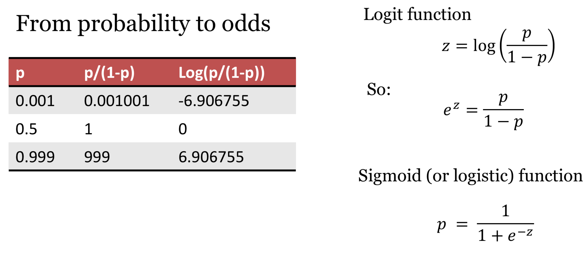

### Learning

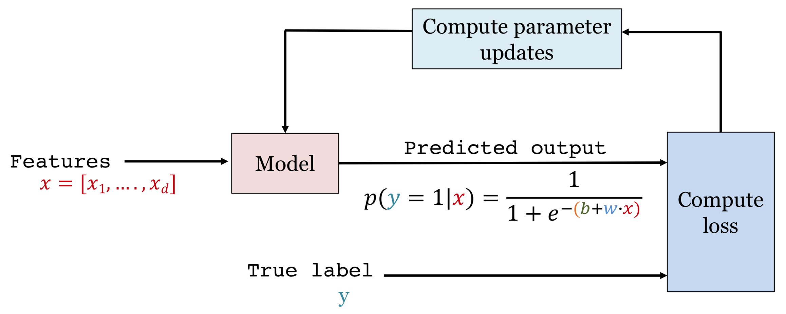

#### Loss Function

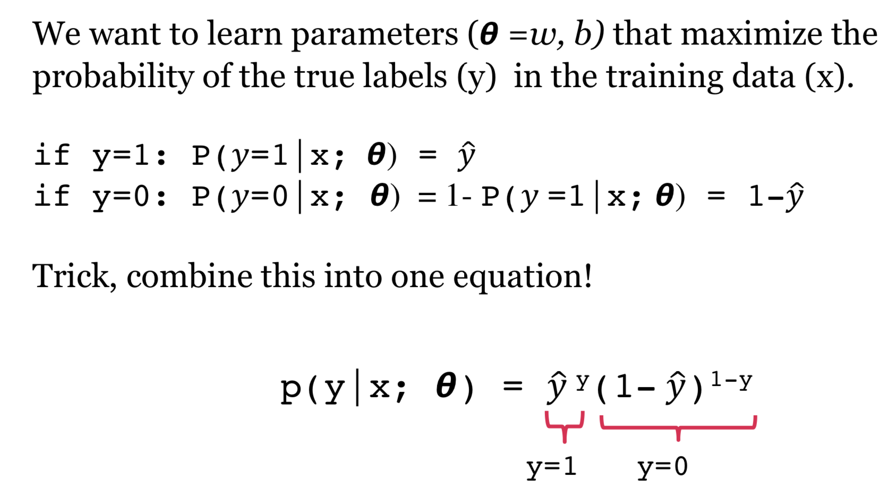

**Log tranformation**:
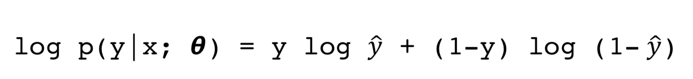

**Cross-entropy loss**
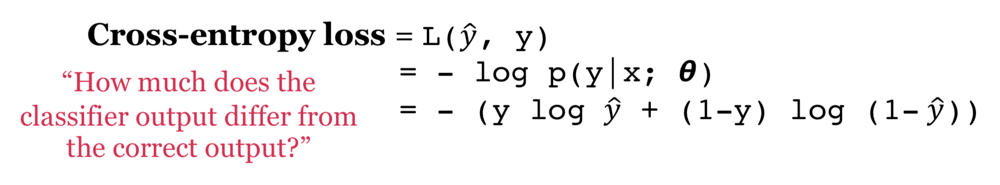
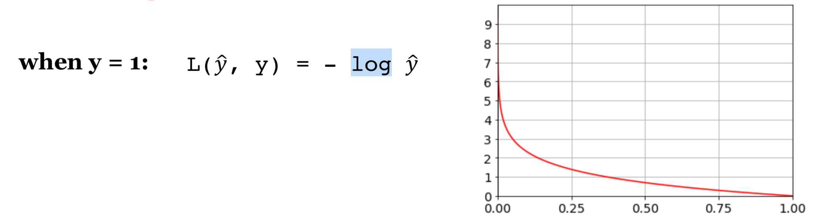

**Loss function**
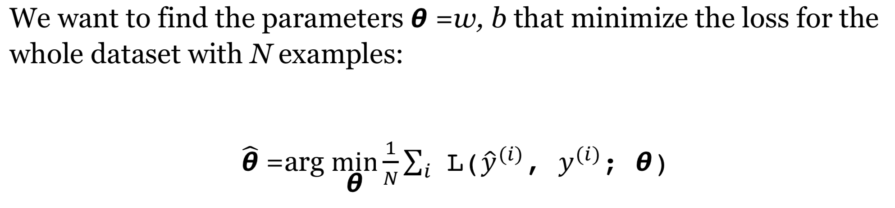

#### Gradient Descent

**Gradient is a multi-variable generalization of the slope!**

When w is a scalar, below is the example where y is the loss function, y = (w + 3)2
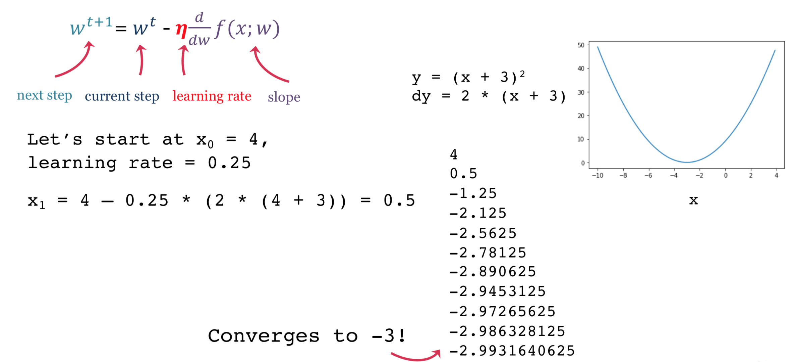

When w is a matrix:

	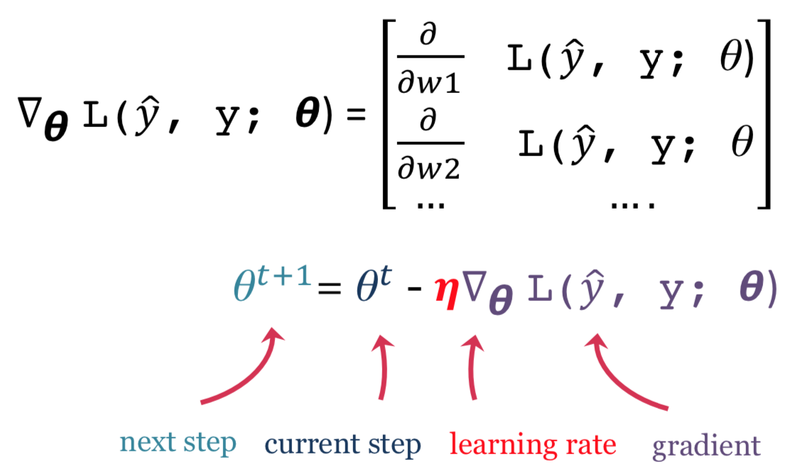

#### Regularization

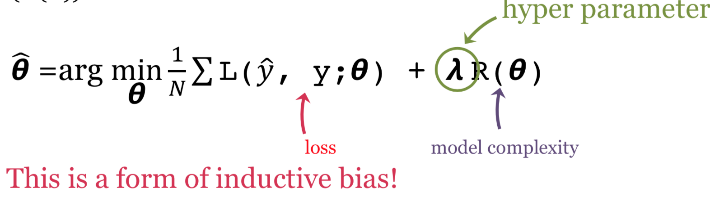
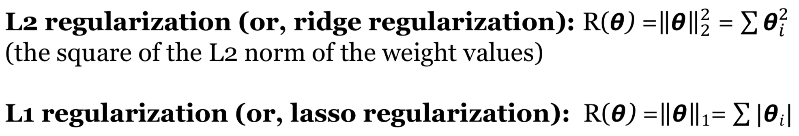

### Multiclass classification

### Comparison

**Features**:
* **Decision trees**: Features are manually specified, only a small number of features are used.
* **K-nearest neighbors**: Features are manually specified, all features are used with equal weight.
* **Logistic regression**: Features are manually specified, All features are used, but some features are more important than others.
* **Neural networks**: Features are NOT manually specified.

**Decision boundaries**:
* **Decision trees**: non-linear decision boundaries.
* **K-nearest neighbors**: non-linear decision boundaries.
* **Logistic regression**: a linear decision boundary.
* **Neural networks**: non-linear decision boundaries.

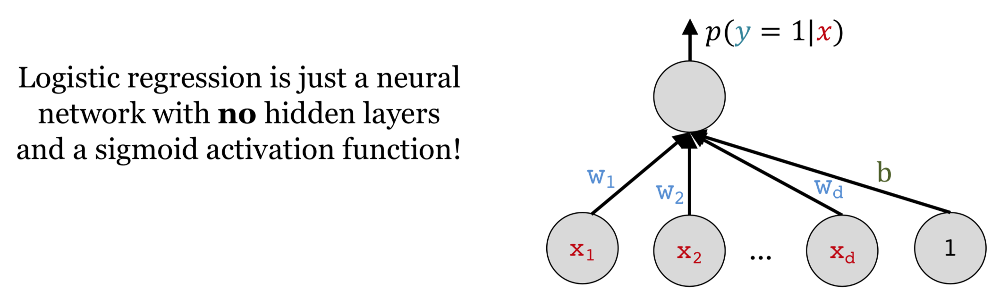

### XOR network
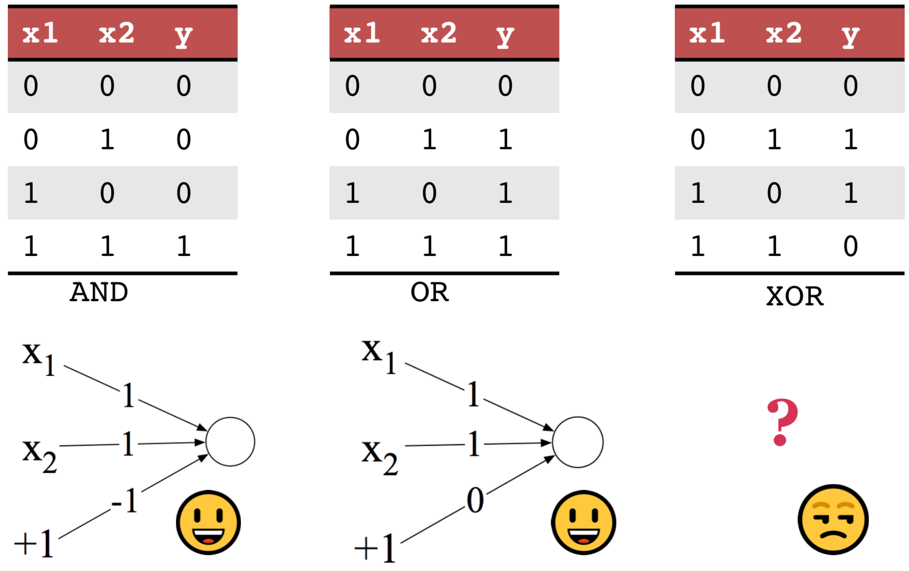
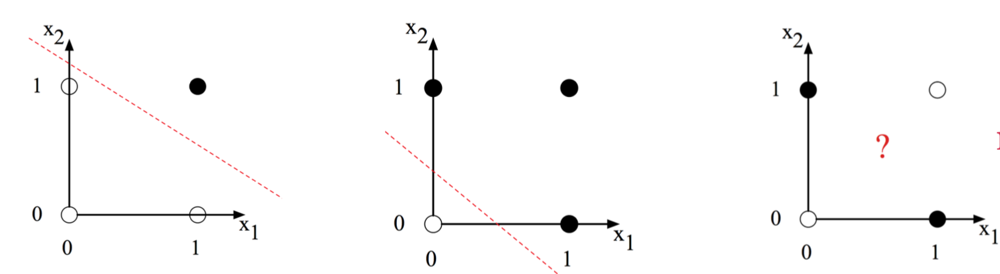
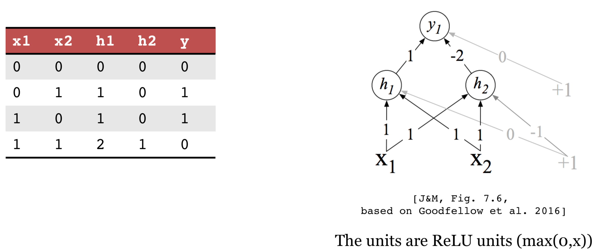
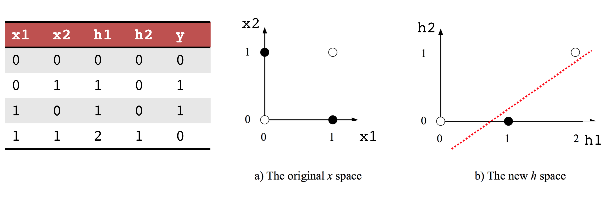

### Neural Networks

#### Hyperparameters
* Number of hidden layers
* Size of hidden layers at each layer
* Learning rate
* Batch size
* Dropout rate
* Regularization parameters
* Activation functions

### Reference

* https://developers.google.com/machine-learning/crash-course/reducing-loss/an-iterative-approach
* https://karpathy.github.io/2019/04/25/recipe/
* https://www.thispersondoesnotexist.com/
* http://www.whichfaceisreal.com/
* https://keras.io/
* https://pytorch.org/
* https://www.tensorflow.org/

