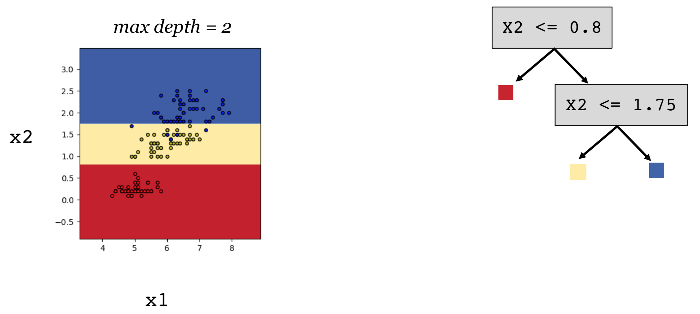

## Machine Learning

### What is Machine Learning?

* **Task T**
	* Classify the dialog act of an utterance
* **Experience E**
	* A set of utterances labeled with their dialog acts
* **Performance measure P**
	* The fraction of utterances correctly classified

### Experience

* **Supervised learning**: Learn a model using **labelled** instances, e.g. image classification
	* Naive Bayes
	* Logistic Regression
	* Support Vector Machine (SVM)
	* Neural Network
	* Decision Tree
	* K-nearest neighbours
* **Unsupervised learning**: Learn a model using **unlabelled** data, e.g. community detection
* **Reinforcement learning**: Agent, e.g. conversational agent

### Supervised Learning

* **Hand crafted rule**: 'Buy' AND ('cheap' OR 'free') => spam
	* Time-consuming
	* High maintenance cost
	* Difficult for tasks, e.g. Author identification of texts. 
		* NOT about **specific words**, but about the (relative) **frequencies of words** and **grammatical constructions**.

* **Machine learning model**
	* **Features**: characteristics of the instances that the model uses for predictions.
	* **Setting**
		* **X**: input space, e.g. features and dimension of the features: x(i) ∈ R2
		* **Y**: output space, e.g. targets and dimension of the targets: y(i) ∈ {0, 1}
		* **H = {f|f: X -> Y}**: set of hypotheses = set of all possible classifiers we consider
	* **Learning**
		* **Input: < x(i), y(i) >**: training examples
		* **Learning algorithm**: defines a data-driven search over the hypothesis space
	* **Output: f ∈ F**: hypothesis that approximates the target function

### Learning

* **Generalization** and **Inductive bias**: Underlying assumptions to generalize to new input!
* **Parameters** and **Hyper parameters**
	* Parameters: The weights or structure selected by the learning algorithm.
	* Hyper parameters: 'Things' we can tune but are not selected by the learning algorithm. 
* **Overfitting** and **Underfitting**

### Evaluation

* **Accuracy**

* **Precision**

* **Recall**

* **Precision recall curve**

	
	
	

* **F-measure**

	* Fβ =(1+β2)((precision × recall) / (precision + recall))
	* Often β = 1: F1 = (2 × precision × recall) / (precision + recall)

### Decision Tree

* Decision tree represents **disjunction of conjunctions of constraints** on the attribute values.
	* (Outlook = Sunny ∧ Humidity = Normal) V (Outlook = Overcast) V (Outlook = Rain ∧ Wind = Weak)
* Decision tree can be represented as **if-then rules**.
* Find the best tree h ∈ H, i.e. the tree that **minimizes training error**, or **maximizes training accuracy** by **greedy search**.
	* **Misclassification rate**: What is the error when choosing the **majority label** after a split?
	
	
	* **Entropy**: H(S) = - SUM(pilog2pi)
		* [14+, 0-]: -(14/14)log2(14/14) – (0/14)log2(0/14) = 0
		* [7+, 7-]: -(7/14)log2(7/14) – (7/14)log2(7/14) = 1
	* **Information gain**: Entropy before you split – entropy after split (weighted by probability of following each branch)
	* **Decision boundary**
	
	
	

### Reference
* 
