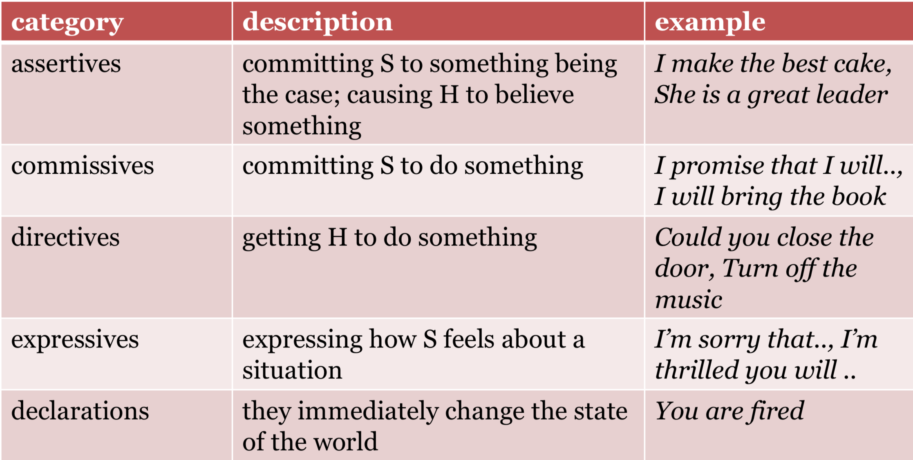
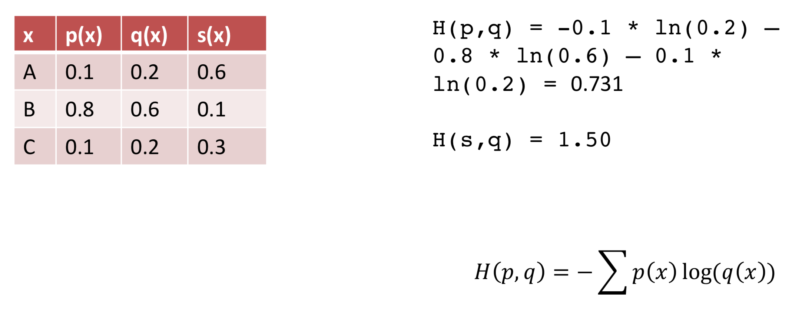
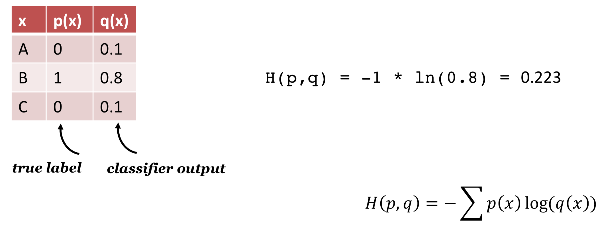
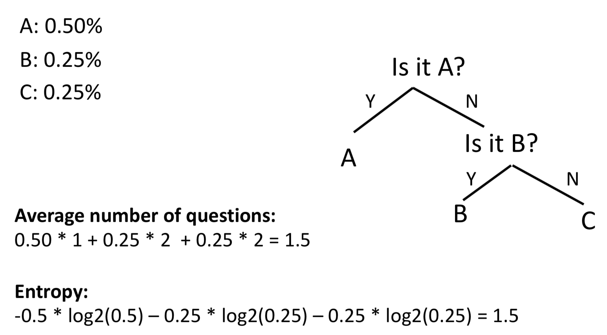

## Social Linguistics

### Speech Act

Utterances:
* **constatives**: true/false statements
* **performatives**: action (do)

Types of acts:
* **locutionary act**: basic act of uttering a linguistic expression ('what is said')
* **illocutionary act**: the kind of action the speaker intends to accomplish ('what is meant') -> speech act
* **perlocutionary act**: effects produced on the audience

The same **locutionary act** can have different **illocutionary forces** in different contexts:
* 'The gun is loaded' -> threatening? explaining?

The same **illocutionary act** can be realized by different **locutionary acts**:
* 'Could you close the door?' or 'Close the door, please!'

Speech act taxonomy:

### Dialog Act

Comparison:
* Speech act focuses on the **intention** of the speaker.
* Dialogue requires **coordination** amongst speakers:
	* Many actions in dialogue serve to manage the **interaction** itself, which are overlooked by speech act.

Conversational structure:
* **Adjacency pairs**: Pairing of two dialog acts
	* Question and Answer
	* Greeting and Greeting
	* Proposal and Acceptance/Rejection

Identify dialog acts:
* **Words**: Please, Would you -> request
* **Conversational structure**: yeah after a proposal vs yeah after an inform
* **Prosody**: Final rising pitch -> question

### Two Components

* **Content planning** ('what to say')
* **Sentence realization** ('how to say it')
	* **Sentence templates**: 
		* There is a restaurant in the X area of town called Y in the Z price range
	* **Syntactic rules**: 
		* There issg/areplur a restaurantsg/restaurantsplur in the X area
	* **Referring expressions**:
		* There is a restaurant in X -> There is a restaurant 'in the same area'
	* **Consistent persona**

### Cross Entropy

How to compare two probability distributions? -> Cross entropy

Cross entropy loss:

Entropy:

### Reference

* https://www.mitpressjournals.org/doi/full/10.1162/COLI_a_00258#.%20V-jwiqJ95cR
* http://users.monash.edu.au/~kallan/papers/Speechacts.html
* http://compprag.christopherpotts.net/swda.html

